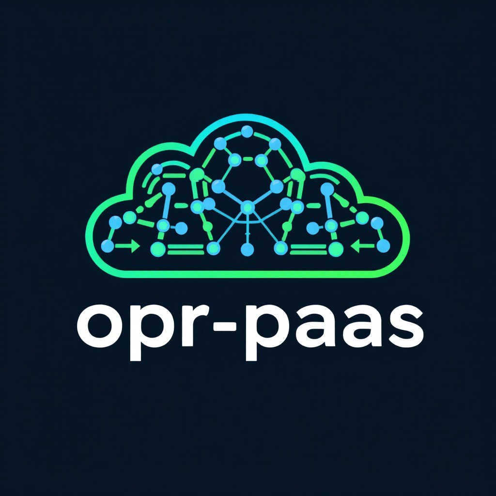

# opr-paas



## Goal

The Paas operator delivers an opinionated 'Project as a Service' implementation where
development teams can request a 'Project as a Service' by defining a Paas resource.

A Paas resource is used by the operator as an input to create namespaces limited
by Cluster Resource Quota's, granting groups permissions and (together with a clusterwide
ArgoCD) creating capabilities such as:

- a Paas specific deployment of ArgoCD (continuous deployment);
- Tekton (continuous integration);
- Grafana (observability); and
- KeyCloak (Application level Single Sign On);

A Paas is all a team needs to hit the ground running.

## Quickstart

Deploy the operator using the following commands:

```
kubectl apply -f https://github.com/belastingdienst/opr-paas/releases/latest/download/install.yaml
kubectl apply -f https://raw.githubusercontent.com/belastingdienst/opr-paas/refs/heads/main/examples/resources/_v1alpha1_paasconfig.yaml
```

The second command will load an example PaasConfig resource from the main branch
to get you going. Feel free to replace this with your own or a release specific
version instead.

This will install the operator using the `install.yaml` that was generated for the
latest release. It will create:

- a namespace called `paas-system`;
- 3 CRDs (`Paas`, `PaasNs` and `PaasConfig`);
- a service account, role, role binding, cluster role and cluster role binding for
  all permissions required by the operator;
- a viewer & an editor cluster role for all crds;
- a deployment running the operator;

Feel free to change config as required.

## Background information

- [build-kubernetes-operator-six-steps](https://developers.redhat.com/articles/2021/09/07/build-kubernetes-operator-six-steps#setup_and_prerequisites)
- [operator sdk installation instructions](https://sdk.operatorframework.io/docs/installation/)

## Contributing

Please refer to our documentation in the [CONTRIBUTING.md](./CONTRIBUTING.md) file
and the Developer Guide section of the documentation site if you want to help us
improve the Paas Operator.

## License

Copyright 2024, Tax Administration of The Netherlands.
Licensed under the EUPL 1.2.

See [LICENSE.md](./LICENSE.md) for details.
