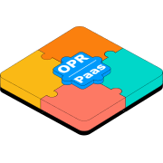
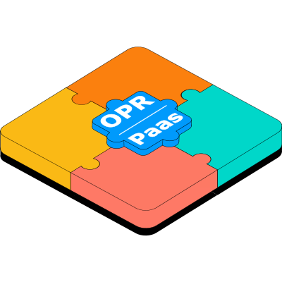
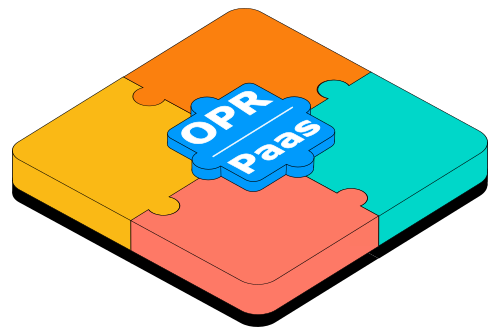

# Branding

The Paas Operator, like many open source projects, has a logo. You can find the
source of this logo (.svg format, made with Inkscape) in the `docs/about/branding`
directory of the Git repository.

You can also find a set of larger and smaller .png versions in that same directory,
which are included on this page.

!!! Info "&copy; 2025 Tax Administration of The Netherlands."

    The branding, logo and its related assets are all: &copy; copyright 2025 Tax
    Administration of The Netherlands.

## Logo

### SVG formatted source

The file was created with Inkscape 1.4.

<figure markdown="span">
  { loading=lazy }
  <figcaption>SVG source file</figcaption>
</figure>

### PNG formatted size variants

<figure markdown="span">
  { loading=lazy }
  <figcaption>16x16px</figcaption>
</figure>

<figure markdown="span">
  { loading=lazy }
  <figcaption>32x32px</figcaption>
</figure>

<figure markdown="span">
  { loading=lazy }
  <figcaption>120x80px</figcaption>
</figure>

<figure markdown="span">
  { loading=lazy }
  <figcaption>149x100px</figcaption>
</figure>

<figure markdown="span">
  { loading=lazy }
  <figcaption>180x180px</figcaption>
</figure>

<figure markdown="span">
  { loading=lazy }
  <figcaption>400x400px</figcaption>
</figure>

<figure markdown="span">
  { loading=lazy }
  <figcaption>500x335px</figcaption>
</figure>
