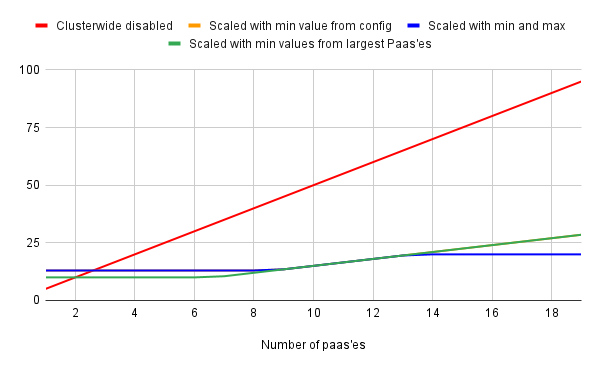

Benefits of using CWQs
======================

The following is a good example of the benefits when implementing cluster wide
quotas. The example makes use of Tekton.

Without Cluster Wide Quotas
---------------------------

Without Cluster Wide Quotas, every Tekton namespace would be linked to a specific
cluster quota. All of these quota would add up to a considerable total quota
reservation.

However, since Tekton pipelines only rarely actually use these quotas on average
about 99% of quota would always be unused. The cluster would either be considerably
over committed or underutilized.

With Cluster Wide Quotas
------------------------

By enabling Cluster Wide Quotas, all Tekton namespaces will be linked to one
cluster wide quota.

The Cluster Wide Quota can be automatically tuned by the Paas operator, having a
minimum, maximum, default, and ratio value.

The algorithm comes down to using the largest value out of 3 different calculations:

- ratio (Paas config) * sum of all Paas resources (either defined or default);
- sum of the largest two of all Paas quotas (either defined or defaulted);
- a hard set minimum (Paas config);

Furthermore, a maximum value (Paas config) can be set to cap the quota.

Example with numbers
--------------------

Consider the following values being set in the Paas config (e.a. for `cpu.limits`):

| cluster wide config |     |                                                                                          |
|---------------------|-----|------------------------------------------------------------------------------------------|
| min value           |  10 | When set, every cluster wide quota has at least this amount.                             |
| max value           |  20 | When set, every cluster wide quota has at most this amount.                              |
| default             |   5 | Resources can be set in Paas. When not set in Paas, this default is used.                |
| ratio               | 0,3 | Scales the sum of all quotas (all Paas'es) down to a lower value for cluster wide quota. |

Now imagine that we would have a cluster where one by one new Paas'es would be
created, with Tekton enabled, all using the default quota config.

Quota reservations would be along lines of:

| # of PAASes | CWQ disabled | Scale by ratio | Scale with min values | Scale with hardset min | Scale with min & max | Savings |
|-------------|--------------|----------------|-----------------------|------------------------|----------------------|---------|
|           1 |            5 |            1,5 |                  10,0 |                   13,0 |                 13,0 |    -8,0 |
|           2 |           10 |            3,0 |                  10,0 |                   13,0 |                 13,0 |    -3,0 |
|           3 |           15 |            4,5 |                  10,0 |                   13,0 |                 13,0 |     2,0 |
|           4 |           20 |            6,0 |                  10,0 |                   13,0 |                 13,0 |     7,0 |
|           5 |           25 |            7,5 |                  10,0 |                   13,0 |                 13,0 |    12,0 |
|           6 |           30 |            9,0 |                  10,0 |                   13,0 |                 13,0 |    17,0 |
|           7 |           35 |           10,5 |                  10,5 |                   13,0 |                 13,0 |    22,0 |
|           8 |           40 |           12,0 |                  12,0 |                   13,0 |                 13,0 |    27,0 |
|           9 |           45 |           13,5 |                  13,5 |                   13,5 |                 13,5 |    31,5 |
|          10 |           50 |           15,0 |                  15,0 |                   15,0 |                 15,0 |    35,0 |
|          11 |           55 |           16,5 |                  16,5 |                   16,5 |                 16,5 |    38,5 |
|          12 |           60 |           18,0 |                  18,0 |                   18,0 |                 18,0 |    42,0 |
|          13 |           65 |           19,5 |                  19,5 |                   19,5 |                 19,5 |    45,5 |
|          14 |           70 |           21,0 |                  21,0 |                   21,0 |                 20,0 |    50,0 |
|          15 |           75 |           22,5 |                  22,5 |                   22,5 |                 20,0 |    55,0 |
|          16 |           80 |           24,0 |                  24,0 |                   24,0 |                 20,0 |    60,0 |
|          17 |           85 |           25,5 |                  25,5 |                   25,5 |                 20,0 |    65,0 |
|          18 |           90 |           27,0 |                  27,0 |                   27,0 |                 20,0 |    70,0 |
|          19 |           95 |           28,5 |                  28,5 |                   28,5 |                 20,0 |    75,0 |

Visualized in a graph, it would look like this:

Once 10 Paas'es would be created:

- without CWQ's, about 50 CPU limits would be reserved for all Tekton namespaces;
- with a ratio of 0.3 only 15 would be reserved, saving 35 CPU limits;

Beyond 14 Paas'es, there would only be 20 CPUs reserved no matter how much Paas'es
would be created.
