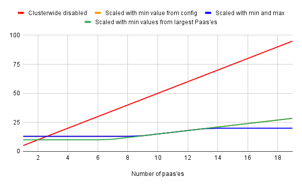

# Cluster Wide Quota's
With cluster wide quota's cluster admins can bring all resources for all Paas'es 
belonging to a capability together in one cluster wide resource pool.
This brings down overcommit at the expense of risk of resource sharing.

## TL;DR if you want to configure a specific usecase

- To run with a quota per paas: set paasconfig.capabilities['tekton'].quotas.clusterwide to `false`
- To use clusterwide quota's with one hard set value (e.a. 10):
  - set paasconfig.capabilities['tekton'].quotas.clusterwide to `true`
  - set paasconfig.capabilities['tekton'].quotas.ratio to 0
  - set paasconfig.capabilities['tekton'].quotas.min to 10
- To use clusterwide quota's with autoscale where every paas is expected to use 1 cpu, minimum of 3 CPU should always be available, a max of 10 can be reserved, and we scale down to 10% of normal usage:
  - set paasconfig.capabilities['tekton'].quotas.clusterwide to `true`
  - set paasconfig.capabilities['tekton'].quotas.default to 1
  - set paasconfig.capabilities['tekton'].quotas.default to 1
  - set paasconfig.capabilities['tekton'].quotas.min to 3
  - set paasconfig.capabilities['tekton'].quotas.max to 10
  - set paasconfig.capabilities['tekton'].quotas.ratio to 0.1 (10%)

## Example with tekton
A good example for implementing clusterwide quota's would be tekton.

### Situation without Cluster Wide Quota's
Without Cluster Wide Quota's, every tekton namespace would be linked to a specific cluster quota.
All of these quota would add up to a conciderable total quota reservation.
But since tekton pipelines only rarely actually use these quota's on average about 99% of quota would always be unused.
The cluster would be either be conciderably overcomitted or underutilized.

### Situation with Cluster Wide Quota's
By enabling Cluster Wide Quota's, all tekton namespaces will be linked to one cluster wide quota.
The cluster wide quota can be automatically tuned by the paas operator having a minimum, a maximum, a default, and a ratio.

The algorithm comes down to using the largest values of 3 different calculations:
- ratio (paas config) * sum of all paas resources (either defined or default)
- sum of the largest two of all paas quotas (either defined or defaulted)
- a hard set minimum (paas config)

Furthermore, a max value (paas config) can be set to cap the quota.

### Example with numbers

Concider the following being set in paas config (e.a. for cpu.limits):

| clusterwide config |     |                                                                                       |
|--------------------|-----|---------------------------------------------------------------------------------------|
| min value          |  10 | When set every clusterwide quota has at least this amount                             |
| max value          |  20 | When set every clusterwide quota has at most this amount                              |
| default            |   5 | Resources can be set in paas, when not set in paas, this default is used              |
| ratio              | 0,3 | Scales the sum of all quota (all PaaS'es) down to a lower value for clusterwide qouota |

Now imagine that we would have a cluster where one by one new PaaS'es would be created, with tekton enabled, all using default quota config.
Quota reservations would be along lines of:

| Number of paas'es | Clusterwide disabled | Scaled by ratio | Scaled with min values from largest Paas'es | Scaled with min value from config | Scaled with min and max | Savings |
|-------------------|----------------------|-----------------|---------------------------------------------|-----------------------------------|-------------------------|---------|
|                 1 |                    5 |             1,5 |                                        10,0 |                              13,0 |                    13,0 |    -8,0 |
|                 2 |                   10 |             3,0 |                                        10,0 |                              13,0 |                    13,0 |    -3,0 |
|                 3 |                   15 |             4,5 |                                        10,0 |                              13,0 |                    13,0 |     2,0 |
|                 4 |                   20 |             6,0 |                                        10,0 |                              13,0 |                    13,0 |     7,0 |
|                 5 |                   25 |             7,5 |                                        10,0 |                              13,0 |                    13,0 |    12,0 |
|                 6 |                   30 |             9,0 |                                        10,0 |                              13,0 |                    13,0 |    17,0 |
|                 7 |                   35 |            10,5 |                                        10,5 |                              13,0 |                    13,0 |    22,0 |
|                 8 |                   40 |            12,0 |                                        12,0 |                              13,0 |                    13,0 |    27,0 |
|                 9 |                   45 |            13,5 |                                        13,5 |                              13,5 |                    13,5 |    31,5 |
|                10 |                   50 |            15,0 |                                        15,0 |                              15,0 |                    15,0 |    35,0 |
|                11 |                   55 |            16,5 |                                        16,5 |                              16,5 |                    16,5 |    38,5 |
|                12 |                   60 |            18,0 |                                        18,0 |                              18,0 |                    18,0 |    42,0 |
|                13 |                   65 |            19,5 |                                        19,5 |                              19,5 |                    19,5 |    45,5 |
|                14 |                   70 |            21,0 |                                        21,0 |                              21,0 |                    20,0 |    50,0 |
|                15 |                   75 |            22,5 |                                        22,5 |                              22,5 |                    20,0 |    55,0 |
|                16 |                   80 |            24,0 |                                        24,0 |                              24,0 |                    20,0 |    60,0 |
|                17 |                   85 |            25,5 |                                        25,5 |                              25,5 |                    20,0 |    65,0 |
|                18 |                   90 |            27,0 |                                        27,0 |                              27,0 |                    20,0 |    70,0 |
|                19 |                   95 |            28,5 |                                        28,5 |                              28,5 |                    20,0 |    75,0 |

Visualized in a graph this would look like:

Once 10 Paas'es would be created:
- without clusterwide quota's about 50 CPU limits would be reserved for all tekton namespaces
- with a ratio of 0.3 only 15 would be reserved, saving 35 CPU limits

Beyond 14 Paas'es there would only be 20 CPU's reserved no matter how much Paas'es would be created.
