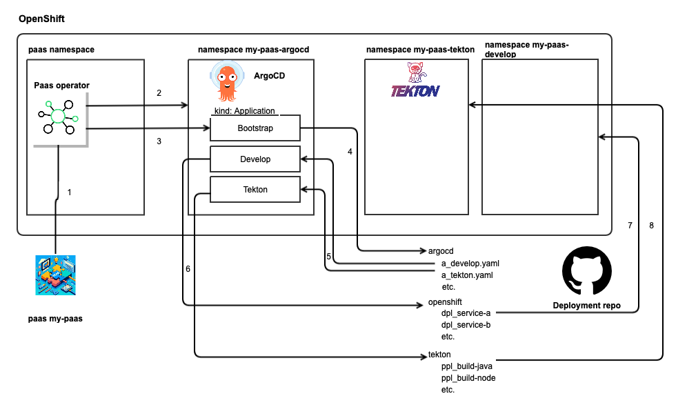

# OpenShift

The whole idea we tried to solve with the Paas operator, is to create a multi tenancy
solution which allows DevOps teams to request a context for their project, which
we like to call a 'Project as a Service', e.a. Paas.

This aligns heavily with large clusters servicing multiple DevOps teams, which
aligns closely with how we see other organizations running OpenShift.

For other deployments we mostly see small (nearly vanilla) K8S deployments, where
each cluster is only servicing one Devops team specifically. However, we do also
feel that having a single interface to consume features like user management,
capabilities, and quota management could be helpful to have in non-OpenShift
environments too.

## OpenShift specific dependencies

We rely on OpenShift for the following features:

- Cluster Wide Quotas, which seems to be built into the core of OpenShift and does
  not seem to have a k8s generic alternative. Running on vanilla K8S, we would
  probably leave options to have one quota for multiple namespaces and implement
  normal ResourceQuota definitions instead.
- We currently rely on the Groups implementation in OpenShift. We are revisiting
  the current architecture and will work towards a solution that can work natively
  in K8S as good as possible.

## ArgoCD integrations

### ArgoCD operator

The Paas operator has the option to create [capabilities](capabilities.md) and
for the argocd capability we integrate with the [argocd operator](https://github.com/argoproj-labs/argocd-operator).

This means that for the argocd capability, the Paas operator creates the ClusterResourceQuota,
Namespace, Permissions, etc. and creates an ArgoCD resource and a bootstrap Application
(App of the Apps).

The [argocd-operator](github.com/argoproj-labs/argocd-operator) can be used on any
K8S. On OpenShift it is known as the OpenShift GitOps operator and is available
through OLM.

### ArgoCD ApplicationSet List Generators.

The Paas operator has the option to create [capabilities](capabilities.md) and to
keep the implementations of capabilities freely programmable we have integrated
the Paas operator with ArgoCD.

This means that the expectations of running the Paas operator with capabilities,
is that there is a cluster wide ArgoCD deployment available, and for each capability
there is an additional ApplicationSet to manage Paas capabilities.

The Paas operator integrates through these capabilities by managing a list generator
in the ApplicationSet, which in turn creates an ArgoApplication for every enabled
capability in every enabled Paas.

### ArgoCD bootstrap

When the ArgoCD capability is enabled, values from the Paas (git_url, git_revision, git_path) are copied to an application in the argocd capability namespace for the Paas (next to ArgoCD).
Once ArgoCD has been initialized and started, this app-of-the-apps Application will make ArgoCD create all resources which are found in this location (git_url, git_revision, git_path).
The main idea is for the requestor to define all other Applications and ApplicationSets, and link them to the specific end resources that together make up all resources for the CI, Application, etc.

The entire boostrapping of a Paas is performed through the following steps:

1. The Paas is applied on the Kubernetes cluster.
2. The paas operator:

   - creates all namespaces as defined in `spec.namespaces` and a namespace for every enabled capability in `spec.capabilities`.
   - adds an entry in the list generator for this Paas for every capability (argocd being one of them), which creates an Application for every enabled capability for this Paas.
     The Application created for the argocd capability for this Paas makes the cluster-wide argocd create an ArgoCD in the namespace belonging to this capability for this Paas.

3. The paas operator creates the bootstrap Application in the namespace for the ArgoCD deployed in the argocd namespace for this Paas.
4. The bootstrap application makes the ArgoCD running in the argocd namespace for this paas check the github repo and create all (Application and ApplicationSet) resources as defined there.
5. One Application (as defined by the requestor in his git repo) has all resources in the tekton namespace created.
   This could be pipelines, trigger templates, etc. Everything as required to define and run CI.
6. An ApplicationSet might have a github generator which is triggered by github Pull Requests.
   The generater creates an Application for every PR
   The Application creates all resources as defined in a namespace belonging to the paas.
   Tekton could then be utilized to run e2e tests against the deployed version of the application and return feedback to the Pull Request.
