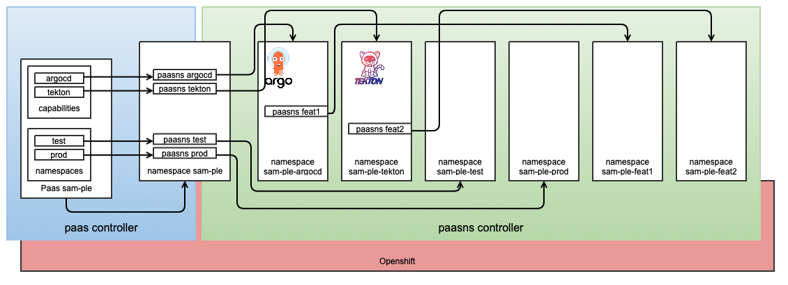

# PaasNs

We wanted to enable our DevOps teams without them requiring self-provisioner
permissions. The main reason is that self-provisioner is too broadly usable and
abusable, and as such we could not enforce the guardrails we felt that a true
multi-tenancy solution should protect.

However, we also wanted to bring them as much self-service as we could think of
and dynamically creating and destroying namespaces felt like part of the flexibility
that would be required.

For this exact reason, we have introduced the concept of PaasNs.

The concept works as follows:


For every Paas, the operator also creates a system namespace called exactly the
same as the Paas. This system is not visible to DevOps teams and is only meant to
be used by the Paas operator to keep the PaasNs objects for all capabilities and
namespaces which are directly defined in the Paas, meaning:

- all namespaces in the `spec.namespaces` block of a Paas resource;
- all namespaces required by Paas capabilities;

Besides PaasNs resources created directly by the Paas controller, Devops teams
can also create their own PaasNs resources as long as they are created in a
namespace belonging to the Paas.

As an example, assuming a Paas called `my-paas` with:

!!! example

    ```yaml
    ---
    apiVersion: cpet.belastingdienst.nl/v1alpha1
    kind: Paas
    metadata:
      name: my-paas
    spec:
      capabilities:
        # The argocd capability enabled
        argocd:
          enabled: true
      requestor: my-team
      quota:
        limits.cpu: "40"
      sshSecrets:
        'ssh://git@my-git-host/my-git-repo.git': >-
          2wkeKe...g==
    ```

To add user namespaces, the following options are available:

- In this Paas, the `spec.namespaces` field could have a list of namespaces.
  If this would be set to (just as an example) `[ ns1, ns2, ns3 ]`, the Paas
  controller would create three PaasNs resources in a namespace called `my-paas`.

  The PaasNs controller would process them as being part of `my-paas` and create
  the following namespaces: `my-paas-ns1`, `my-paas-ns2` and `my-paas-ns3`.

- Another option would be to manually create a PaasNs resource in a namespace
  which already belongs to `my-paas`.

!!! example

    ```yaml
    ---
    apiVersion: cpet.belastingdienst.nl/v1alpha1
    kind: PaasNs
    metadata:
      name: my-ns
      namespace: my-paas-argocd
    spec:
      Paas: my-paas
    ```

- Yet another option would be to create a PaasNs resource using automation such as
  `argocd` or `tekton`.
  It is advised to create them in the namespace belonging to the capability that
  is being used (e.a. `my-paas-argocd` or `my-paas-tekton`).

- A cool feature is that PaasNs resources could be stacked. This means that a
  PaasNs resource could be in a namespace which is the product of a PaasNs
  resources in a namespace, which...

  As as the top namespace is the product of a PaasNs resource in the namespace
  called after the Paas, all child PaasNs's are assumed to be part of the same Paas.

!!! Note
Note that besides creating the namespaces, the PaasNs controller also properly
sets up the namespace with the proper quota and the proper [authorization](authorization.yaml).
