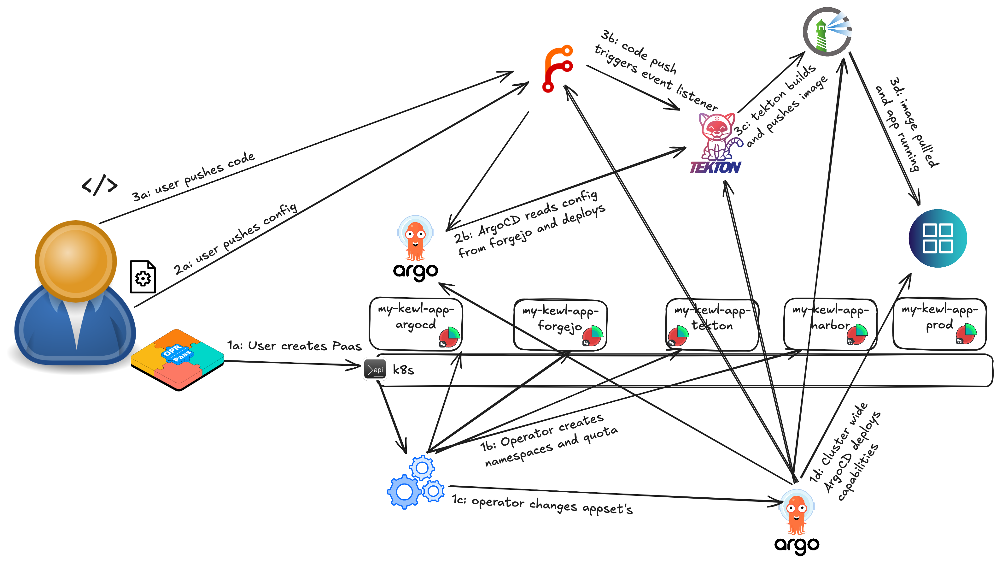

# Common use cases

## Develop and deploy a new microservice

In this example, a developer has created some java code which is to become a new
microservice running on a k8s cluster.

In this organization, we have a very proactive and forthcoming group of administrators,
which have enabled their dev teams with the following capabilities:

- forgejo;
- tekton;
- vault (HashiCorp Vault);
- harbor;
- argocd;
- grafana;

Of course, this developer requires all of these capabilities, and additionally he
requires a namespace for his production environment. Furthermore, this developer
will set up options to dynamically create and destroy test namespaces with the (micro)
service being deployed fully functional.

### Defining the Paas

Let's first define the Paas:

!!! example

    ```yaml
    apiVersion: cpet.belastingdienst.nl/v1alpha2
    kind: Paas
    metadata:
      name: my-kewl-app
    spec:
      capabilities:
        forgejo: {}
        tekton: {}
        vault: {}
        harbor: {}
        argocd: {}
        grafana: {}
      namespaces:
        prod: {}
      quota:
        limits.cpu: '42'
        limits.memory: 11Gi
        requests.storage: 13Gi
    ```

### What actually happens

Once the Paas has been applied, the Paas operator takes over and the following happens:

- The following namespaces are created: my-kewl-app-forgejo, my-kewl-app-tekton,
  my-kewl-app-vault, my-kewl-app-harbor, my-kewl-app-argocd, my-kewl-app-grafana, my-kewl-app-prod;
- The following ClusterResourceQuotas are created: my-kewl-app, my-kewl-app-forgejo,
  my-kewl-app-tekton, my-kewl-app-vault, my-kewl-app-harbor, my-kewl-app-argocd, my-kewl-app-grafana;
    - Namespaces my-kewl-app-prod are linked to ClusterResourceQuota my-kewl-app;
    - all other namespaces are linked to their own ClusterResourceQuotas named exactly like the namespace;
- In a namespace with a cluster-wide ArgoCD the list generator in the ApplicationSets
  belonging to the enabled capabilities are extended with an extra item for this Paas,
  which in turn creates ArgoCD applications for the capability for this Paas;
- Each of these Applications triggers the cluster-wide ArgoCD to deploy all capability
  resources in the specific namespace belonging to this Paas;
- All capabilities in the namespaces start coming to life;
- The developer logs in to forgejo, creates an organization, creates a configuration
  repository and pushes his configuration definition.
    - immediately, the argocd belonging to this paas notices the configuration files,
      and starts to apply;
    - argocd creates tekton tasks, pipelines, trigger templates and event listeners in
      the tekton namespace belonging to this Paas;
    - argocd creates custom dashboards in the grafana namespace;
    - argocd creates a production deployment in the my-kewl-app-prod namespace including
      the required PostgreSQL database, Kafka deployment and Minio tenant;
- The developer creates a code repository, with webhook integration to the tekton event
  listener, and pushes his code;
    - immediately, tekton starts pulling his code, building images and pushes to harbor;
    - after which the application deployment in my-kewl-app-prod picks up the image and becomes externally accessible;
    - application receives data that requires encrypted storage, creates keypairs, stores
      them in vault, encrypts the data and stores it in the Postgres database;

{ loading=lazy }
